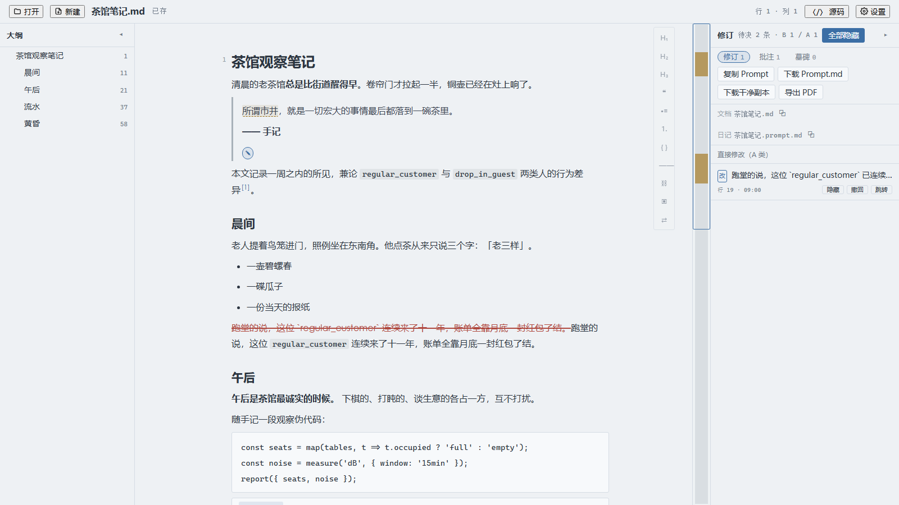
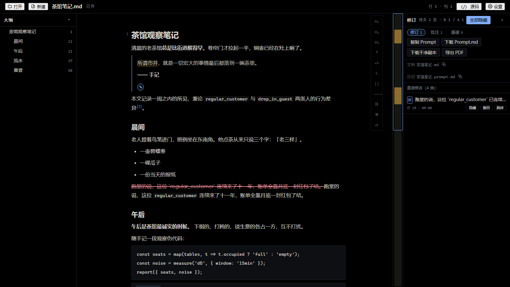
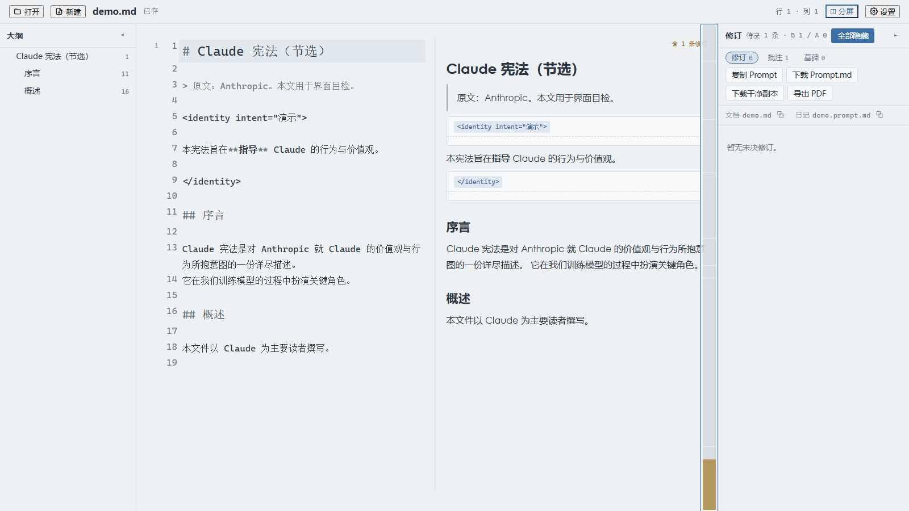

# 2youg1's MD2Prompt

[中文](README.md) · [Download](../../releases) · [Design spec (中文)](SPEC.md) · [Feedback (Discussions)](../../discussions) · [Pull requests](../../pulls)

> Built entirely with [Kimi K3](https://www.moonshot.cn) — no other models were used at any point.

**One HTML file — the revision workbench between you and your AI.**

Double-click, edit Markdown like Word, and every change is tracked automatically. Hit "Copy Prompt" and the AI — without seeing the original file, without any tool calls — reads exactly what you changed and what you still want done.



## Why it exists

Three chronic pains of remote AI co-writing:

1. **Word wastes tokens** — AI speaks Markdown natively; nobody wants to paste a `.docx`;
2. **Common renderers swallow prompt-style XML tags** — `<identity>`-style structural hints for agents vanish silently, and editing diagram source in Notepad is an escaping disaster;
3. **Every round means re-uploading the whole file** — three sentences changed, three hundred KB transferred.

MD2Prompt's answer: **the protocol matters more than the editor.** The editor is a thin layer; the real product is a protocol-precise `Prompt.md` diary — your edits and annotations, saved in real time, in a format an AI can consume exactly. The original text is already in the AI's context (it wrote it); the diary ships only the delta.

## 30-second quickstart

1. Grab `2youg1-md2prompt.html` from [Releases](../../releases) (one 6 MB file with all dependencies inlined; no backend, API, or telemetry; local-file editing works offline, while remote images and external links still use the network under normal browser rules);
2. Double-click (Chrome/Edge recommended), click 「打开」 and pick your `.md` / `.jsonl` / `.xml`;
3. Just edit. Cards appear instantly in the right 「修订」 panel;
4. Click 「复制 Prompt」 and paste to your AI. It receives: file name, BLAKE3 hash, every edit (original + alter + line), every note (request / suggest / discuss);
5. When the AI returns a new version, save it and 「打开」 again — if the hash pairs, **all your previous tracked changes restore automatically**. Keep iterating.

> Foolproof by design: the original stays clean and every action is auto-saved. Even if you close the tab outright, `name.prompt.md` in the same folder still gives you a paste-ready prompt.

## Feature tour

- **Edit-and-track**: replace / insert / delete / swap / annotate — recorded at sentence granularity (old struck through, new highlighted), like Word track-changes without an "accept" step.
- **Three kinds of notes**: select text → floating ✎ card (or `Alt+M`) — **request** (do exactly this) / **suggest** (AI decides) / **discuss** (talk only, no edits), switchable in the floater; dashed underline + pin; sidebar card shows the quote, editable, withdrawable.
- **Block swap**: `Alt+↑/↓` swaps with the neighbor (auto-recorded); the ⇄ rail button swaps with any line's block — swap is self-inverse, so withdraw/restore is just swapping again.
- **Hide / Withdraw (two-stage)**: "Hide" collapses confirmed edits; "Withdraw" previews strikethrough first (cancellable), confirm to actually revert; withdrawn edits become tombstones (capped at 50), revivable anytime.
- **Render / Source / Split modes**: WYSIWYG; a CodeMirror source editor (syntax highlighting, line numbers, find & replace); or split view with **block-anchored row alignment** (matching block tops, not crude ratio sync). Notes and inline formatting (B/I/S/code/link) work in **all three modes**.
- **Edit XML cards in place**: prompt-style tag blocks render as cards whose source you edit directly — tracked per keystroke, no modal whole-block replacement.
- **Faithful rendering**: Mermaid, KaTeX, tables, images (relative paths via directory permission), footnote popovers.
- **JSONL dataset mode**: virtualized record-card stream (smooth at 10k+ lines), form/raw-JSON dual-tab editor — an AI training-data cleaning bench.
- **XML files in source mode**: a whole `.xml` is one code block edited in CodeMirror — clean revision semantics (one block replace, auto-patched for large files).
- **Large-document friendly**: auto-splits above 300 KB / 2000 lines; incremental reparse makes keystroke commit O(change) instead of O(section) (341 ms → 2.3 ms on a 300 KB section).
- **3 themes × 2 styles**: pure-black / marble / warm-paper × geek / humanist; font size & weight, line height, page width (any value works), alignment, brightness/contrast, CJK & Latin font stacks, first-line indent, line-number gutter, guide lines — a genuine Word replacement for long-form writing.
- **Editing tools**: vertical tool rail (headings/quote/lists/code/rule/link/image/swap) + selection float card + customizable shortcuts.
- **Exports**: copy Prompt (tombstones omitted) / download Prompt.md / download clean copy / export PDF (header: source-file completion time, footer: export time).




## Manual

### Opening & saving

- 「打开」 uses the browser's File System Access API (Chrome/Edge); Firefox falls back to upload/download. File handles live in your own IndexedDB — click anywhere after a restart to resume the last document.
- On open you'll be asked for **parent-directory permission**: it resolves relative image paths and writes the `name.prompt.md` diary next to your document. Declining is fine — images show placeholders and the diary stops auto-saving (「下载 Prompt.md」 still works manually).
- Every action is auto-saved inside an 800 ms debounce (top bar: 已存/写入中/失败）. Diary-write failures are reported on a separate channel from document-save failures.

### Editing & tracking

- Just edit. Replace / insert / delete become cards automatically; each card offers 「隐藏」 (confirm & collapse, still exported) and 「撤回」 (two-stage: preview first, then confirm the rollback).
- **Swap**: put the cursor in a paragraph and press `Alt+↑/↓` to swap with the neighbor; or click the rail's 「⇄」 and enter a line number to swap with that line's block.

### Notes (three kinds)

- Select text → floating 「✎」, or press `Alt+M` with no selection (current block). Pick the kind at the top of the floater:
  - **命令 request** — "do exactly this": the AI executes and returns revised text;
  - **建议 suggest** — "I think this is better, your call": the AI decides;
  - **讨论 discuss** — "I'm stuck here": the AI only answers, no edits.
- Annotating the same block again edits the existing note (text, kind, or quote).

### Restore & pairing

- A `name.prompt.md` next to the document with a matching hash restores all tracked changes automatically.
- On hash mismatch (the document changed externally) you choose: **new baseline** / **try restoring anyway** / **ignore** (keep the old diary untouched — nothing gets overwritten this session).

### Exporting to the AI

- **复制 Prompt**: the daily path — tombstones omitted, self-explanatory structure, Opus/K3-class models read it directly;
- **下载 Prompt.md**: the full diary (with tombstones);
- **下载干净副本**: current document text, no marks;
- **导出 PDF**: browser print, header = source-file completion time, footer = export time.

## The protocol at a glance (2.0)

```xml
---
protocol: md2prompt/2.0.0
doc: constitution-zh.md
doc-hash: blake3:9f2c…
base-hash: blake3:71be…
changes: 3
---

# 修改记录 · constitution-zh.md
<!-- This is the human's edit diary (you hold the original; line numbers are current-doc):
     revise/swap = already done by the human (context only); note = for you to act on
     (request = do it, suggest = your call, discuss = talk only). -->

<changes>
<note n="1" line="56" request="Split this sentence in two and add an example."><range>The constitution guides Claude's values and behavior…</range></note>
<revise n="2" line="102"><original>…original…</original><alter>…revised…</alter></revise>
<swap n="3" a="40" b="52"><first>first line of block A</first><first>first line of block B</first></swap>
</changes>
```

- One `<changes>` stream ordered by `n` (modification order), stable across exports (cache-friendly);
- notes fold into a single attribute line; a `revise` without `original` is an insertion, without `alter` a deletion; large edits ship as `<del>/<ins>` patches (token-lean);
- tombstones stay in the diary file and are omitted when copying.

Full protocol in [SPEC.md](SPEC.md) §3 (Chinese; the single source of truth, with the full revision history).

## Changelog

### 2.0.0 (vs 1.5.2)

**Breaking protocol change (1.x diaries not compatible)**

- Protocol 2.0: single `<changes>` stream ordered by `n`; `<request>/<edit>` retired in favor of `note` (request/suggest/discuss) and `revise` (original+alter); `time` attribute removed; copy version omits tombstones and their count; self-explanatory structure (Opus/K3-class models read it directly).
- `move` retired; `swap` takes over — new "swap line X with line Y" command (Alt+↑/↓ adjacent, ⇄ for any line).

**Fixes**

- Wrong-line revision decorations & selection anchors in long docs (tag-region merge at the IR level); sentences no longer split at `SKILL.md`-style tokens; page width >60 display failure; split-view row alignment (block-anchored sync); notes & inline formatting now work in source/split modes; XML revision semantics (single-block diff in source mode); "Ignore" no longer lets later edits overwrite the diary; math_block Ctrl+A escape; diary-write failures now surfaced.

**Performance**

- Incremental reparse ≈148× on large sections (341 ms → 2.3 ms at 300 KB); global cap on the diff DP matrix; 10k-row outlines no longer rebuilt per keystroke.

**Engineering**

- Unit tests 154 → 211 (13 files); E2E gates 6 → 11 (new: measure / split-align / source-annotate / xml-mode / microtypography); MPL-2.0 SPDX headers on all 27 source files; CSP meta in index.html; table-driven safeUrl XSS regression suite.
- GitHub Actions: `check` (tsc + unit tests + build) and `e2e` (all 11 gates) on every push; `v*` tags auto-build and attach the single-file HTML to a GitHub Release.
- Microtypography + OpenType settings group: hanging punctuation / CJK-Latin autospace / punctuation trim / pretty-balance wrapping / tabular nums / oldstyle nums — `@supports`-gated, silently ignored where unsupported.
- Bilingual manual (中文 README.md · English README.en.md).

### 1.5.2

- Initial open-source release (v1.5.1) + PR #2 file-write integrity fixes (cross-target/cross-channel write serialization).

## Build & develop

```bash
bun install
bun run dev      # dev server
bun run build    # produces a single dist/2youg1-md2prompt.html
bun run check    # tsc --noEmit
bun test         # 211 unit tests across 13 files
```

E2E (Playwright, requires Node): `life.mjs`, `v13.mjs`, `note.mjs`, `srcmode.mjs`, `export.mjs`, `look.mjs`, `measure.mjs`, `splitalign.mjs`, `sourceanno.mjs`, and `xmlmode.mjs` report failures with a non-zero exit code. The `qa15-*`, `perf*`, and screenshot scripts are manual probes, not automated gates.

## FAQ

**Why not a VS Code extension?** Because the target workflow is writing, not programming: double-click to run, no runtime, no workflow change. A single HTML file is the lowest possible barrier.

**Does the AI need tool access to cooperate?** No — that's the point. Everything in Prompt.md is self-explanatory text; the AI reads it, knows exactly what to change and how, and returns the new full text. Zero function calls.

**Will you add a reverse-diff for the AI's edits?** No (a settled decision). A new version returned by the AI becomes the "new baseline"; your tracked changes restore on hash pairing and keep stacking — the collaboration stays a simple human→AI one-way protocol.

**Where does my data go?** The app does not upload documents to a server and has no server API or telemetry (the CSP's `connect-src 'none'` backs this up). File I/O goes through the browser's File System Access API; handles live in your own IndexedDB. Remote images in a document are fetched by the browser from their URLs, and following an external link visits that site.

**Is the 2.0 diary compatible with 1.x?** No (breaking change; local single-file workflow carries no legacy). Finish your 1.x sessions in 1.5.2 before upgrading.

## License

MPL-2.0 (see [LICENSE](LICENSE); SPDX headers in every source file). Author: [2youg1](https://github.com/kaile9/md2prompt).
