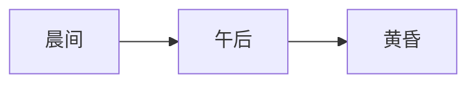

# 茶馆观察笔记

清晨的老茶馆**总是比街道醒得早**。卷帘门才拉起一半，铜壶已经在灶上响了。

> 所谓市井，就是一切宏大的事情最后都落到一碗茶里。
>
> **—— 手记**

本文记录一周之内的所见，兼论 `regular_customer` 与 `drop_in_guest` 两类人的行为差异[^1]。

## 晨间

老人提着鸟笼进门，照例坐在东南角。他点茶从来只说三个字：「老三样」。

- 一壶碧螺春
- 一碟瓜子
- 一份当天的报纸

跑堂的说，这位 `regular_customer` 连续来了十一年，账单全靠月底一封红包了结。

## 午后

**午后是茶馆最诚实的时候。** 下棋的、打盹的、谈生意的各占一方，互不打扰。

随手记一段观察伪代码：

```js
const seats = map(tables, t => t.occupied ? 'full' : 'empty');
const noise = measure('dB', { window: '15min' });
report({ seats, noise });
```

<identity>
你是茶馆档案管理员：只记录事实，不评论客人。
</identity>

## 流水

一周客流大致如下：

| 时段 | 常客 | 散客 |
| --- | --- | --- |
| 晨间 | 23 | 4 |
| 午后 | 31 | 17 |
| 黄昏 | 12 | 9 |

客流曲线（示意）：



若以 $E = mc^2$ 打趣，茶馆的能量大约全部来自那口铜壶。

---

## 黄昏

灯亮起来的时候，说书先生来了。开场总是一句：「上回说到——」

常客们不接话，散客们抬起头。一句话就把两群人分开了。

[^1]: 常客指每月到访超过十五次者，散客指其余；分类只为叙述方便。
